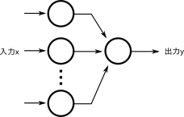
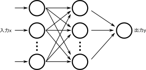
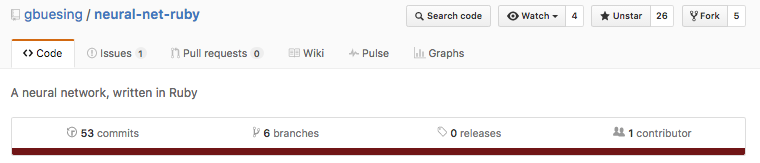
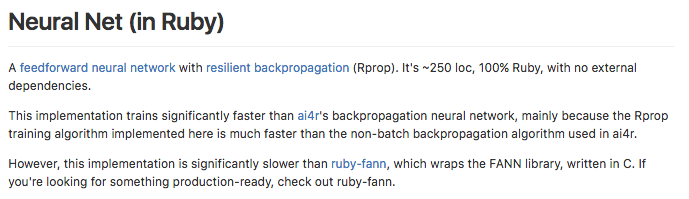

# Rubyで始めるバックプロパゲーションな学習入門

理論から始めてプログラムを試してみる

author
: 戸塚 佑太 @totzyuta

# 自己紹介

* 名前：戸塚佑太 @totzyuta
* コーヒー係

# 会社紹介


トリマーと飼い主さまをつなげる
出張トリミングサービス

>Ruby/Railsエンジニアの方
>フロントエンドエンジニアの方
>一緒につくりませんか！！

# つかってるやつ

* Ruby 2.5
* Rails 4.2.6
* React
* PostgreSQL
* AWS

# つかってるやつ

* GitHub
* Slack
* esa.io
* Asana

# 開発について

* Ruby, Railsは最新版を追従
* bundle updateは週に3回
* 勉強会開催
* もちろんテストも書く

# 今日やりたいこと

理論から始めてニューラルネットワークを使った学習をするバックプロパゲーションのプログラムを試してみたい

※ 機械学習入門者のスライドです (間違いなど多々あると思われます)

# まずは...

その準備としてまずバックプロパゲーションが何なのかということから振り返ってみたいと思います。

# バックプロパゲーションとは何か？

TODO: ひとことでまとめる

そのためには、ニューラルネットワークについてまず知らなければいけない。

ニューラルネットワークとは、ニューロセルを複数結合した情報処理機構である。

# 「ニューロセル」…？？


# ニューロセルとは

* Pittsさん(数学)とMcCullochさん(神経生理学)が1942年に提案
* x * y


# ニューロセルとは②

* ニューロセルはニューラルネットワークにおけるノードに相当する。
* ニューロセル自体は、複数の入力に対し、それぞれに重みをかけたものを足しあわせ、閾値を引いたものを出力とする機構であり、これは神経細胞をモデルにしているらしい。

# ニューロセルとは③

* xを入力、wを重み、vを閾値、zを出力とすると、とすると以下のような式で表せる。

```
u = Σ (x_i * w_i) - v
```

# ニューロセルとは④

* このuを出力関数に突っ込んだ値が出力となる。人間が判断するならここまででもいいような気がするけど、これをコンピュータに理解させやすく変換したい (引用: http://sacraya.610t.org/Press/No18/neuro/)


# ニューロセルとは⑤

```
z = f(u)
```

出力関数には種類があり、テップ関数とシグモイド関数がよく用いられる。

* ステップ関数 ... uが0正なら1, 負なら0
* シグモイド関数 ... f(u) = 1/(1+e^-u)で表される

# ニューロセルとは⑥

ニューロセルは単体でも論理演算をする機構として機能させれる！へぇ〜

# ニューラルネットワークとは

* このニューロセルを複数組み合わせたものがニューラルネットワークと呼ばれるもの。
* 一番簡単なもので言えば、ニューロセル２つの出力を受け取ったニューロセルが1つの出力を出すようなものとか。

# ニューラルネットワーク②

* そんな風に入力された値がネットワークの中を順番に伝播していくニューラルネットは、フィードフォワードネットワーク(feed forward network)または階層型ネットワークと呼ばれる。

# もうひとつ準備が...

そしてバックプロパゲーションを理解するには、まず「パーセプトロン」について理解しなければいけないので復習しておきます

# パーセプトロンとは

* 1958年に Rosenblatt (心理学者・計算機科学者) が提案
* パーセプトロンとは、フィードフォワード型ネットワークのうちの、ある特定の形式をもったニューラルネットをそう呼んでるだけ。


# パーセプトロンとは②

* パーセプトロンは、３層の層構造を持ったニューラルネットであり、中間層から出力層への結合荷重や閾値を学習により変更するというもの。入力層から中間層への結合荷重はランダムな定数とする。



# パーセプトロンとは③

* パーセプトロンでは、入力層から中間層への結合荷重を変更しなくても、中間層から出力層への結合荷重を適切に選ぶことで、論理積や論理和などの動作を行うことができる。こんな風にパーセプトロンはいろんな出力を作り出すことができる！

# パーセプトロンとは④

* ただし、いくら結合荷重を調節しても排他的論理和（XOR）だけは作り出せないことがわかっている。（入力層から中間層への結合荷重の値によっては実現することもできる）。

# パーセプトロンとは⑤

* このように、一般にパーセプトロンでは出力層の結合荷重を調節するだけでは表現できない関数が必ず存在し、この問題を、パーセプトロンの線形分離不可能問題と呼ぶ。

# パーセプトロンとは⑥

* 結合荷重と閾値の学習には、ヘブの学習則なんていう、生物の神経回路網で頻繁に信号を伝達するシナプスの結合がより強化される、ということに着目した方法がある。


# バックプロパゲーションとは

* 前述のパーセプトロンの重大な欠陥である線形分離不可能問題を回避して学習するために、バックプロパゲーションという手法を用いる。

# バックプロパゲーション②

* バックプロパゲーションは、出力層の結合荷重に加えて、中間層(hidden layer/隠れ層)の結合荷重を調節する方法。(色々な条件があるが、ざっくり言うと任意の連続な関数が任意の精度で近似可能になった。もっと簡単にいえば、世の中の大抵の問題が学習可能になった)

# バックプロパゲーション③




# ということで

ということで、
実際にプログラム
動かしてみる！！

# 動作確認

* 今回はこちらのプログラムを動かしてみることにしました



```
https://github.com/gbuesing/neural-net-ruby
```

# neural-net-ruby

ai4rのバックプロパゲーションより速い(らしい)



# 学習データを用意します

iris data setのデータを読み込んで学習させてみます

# Iris Data Set

* CSV: Sepal length(がくの長さ), Sepal width(がくの幅), Petal length(弁の長さ), Petal width(弁の幅), Species(種)
* サンプル数は150
* がくと弁の大きさによって、アヤメの３種のうちどのクラスを出力

# Iris Data Set

```
5.1,3.5,1.4,0.2,Iris-setosa
4.9,3.0,1.4,0.2,Iris-setosa
4.7,3.2,1.3,0.2,Iris-setosa
...
5.7,2.8,4.5,1.3,Iris-versicolor
6.3,3.3,4.7,1.6,Iris-versicolor
4.9,2.4,3.3,1.0,Iris-versicolor
...
6.5,3.0,5.5,1.8,Iris-virginica
7.7,3.8,6.7,2.2,Iris-virginica
7.7,2.6,6.9,2.3,Iris-virginica
```

# 実行結果

```
$ ruby examples/iris.rb                                                                                                              
Testing the untrained network...
Untrained classification success: 16, failure: 34 (classification error: 68%, mse: 28.17%)

Training the network...

[100] 1.72% mse
[200] 1.04% mse
[300] 1.03% mse
[400] 1.03% mse
[500] 1.03% mse
[600] 1.03% mse
[700] 1.03% mse
[800] 1.03% mse
[900] 1.03% mse
[1000] 1.03% mse

Done training the network: 1000 iterations, 1.03% mse, 5.3s

Testing the trained network...
Trained classification success: 48, failure: 2 (classification error: 4%, mse: 1.57%)
```

学習前：32%
学習後：96%
識別率３倍 ✊ ✊


# 学んだこと

* 機械学習にRabbitはやめた方がいい
