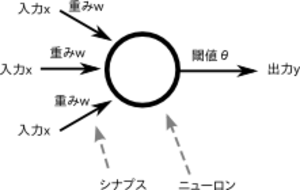

# Rubyで始めるバックプロパゲーションな学習入門

理論から始めてプログラムを試してみる

author
: 戸塚 佑太 @totzyuta

# 自己紹介

* 名前：戸塚佑太 @totzyuta
* コーヒー係

# 会社紹介


トリマーと飼い主さまをつなげる
出張トリミングサービス

# 会社紹介


トリマーと飼い主さまをつなげる
出張トリミングサービス

>Ruby/Railsエンジニアの方
>フロントエンドエンジニアの方
>一緒につくりませんか！！

# つかってるやつ

* Ruby 2.5
* Rails 4.2.6
* React
* PostgreSQL
* AWS

# つかってるやつ

* GitHub
* Slack
* esa.io
* Asana

# 開発について

* bundle updateは週に3回
* もちろんテストも書く
* 面白い・好きだという理由を重視して技術選定
* 社内勉強会
  * 読書会
  * gem reading

# 今日やりたいこと

ディープラーニング！！！！！
機械学習！！！！！
人工知能！！！！！
Alpha 碁！！！！！

# 今日やりたいこと

Rubyの世界にMachine Learningをやってる人が少ない...

# 今日やりたいこと

ニューラルネットワークの理論から始めて、バックプロパゲーションな学習をするプログラムを試してみることで、*RubyistにMachine Learningの門を開けてほしい*

※ 機械学習入門者向けのスライドだし、機械学習入門者のスライドです (PRMLはまだ読めていません...)

# レジュメ

1. バックプロパゲーション(BP)について学ぼう
  * BPを学ぶために必要なもろもろ
2. BPを用いているプログラムを使ってみる
  * Iris Data Setの学習・識別
  * 数値の画像識別プログラム

# バックプロパゲーションまでの道のり

* ニューロセルとは？
* ニューラルネットワークとは？
* パーセプトロンとは？
* *BPとは？*

シンプルな概念を組み合わせてどんどん便利にしてく歴史を雑に学びます

# バックプロパゲーションとは何か？

ひとことでいうと...

ニューラルネットワークにおけるコスト関数の勾配を高速に計算するアルゴリズム

# バックプロパゲーションとは何か？

*ニューラルネットワークの限界に挑戦したい*

# 「ニューロセル」…？？

ニューラルネットワークは、ニューロセルの組み合わせです。

なので、まずは*ニューロセル*について。

# ニューロセルとは

* Pittsさん(数学)とMcCullochさん(神経生理学)が1942年に提案



# ニューロセルとは②

* ニューロセルはニューラルネットワークにおけるノードに相当する。
* ニューロセル自体は、複数の入力に対し、それぞれに重みをかけたものを足しあわせ、閾値を引いたものを出力とする機構
* => 神経細胞をモデルにしている

# ニューロセルとは③

* xを入力、wを重み、vを閾値、zを出力とすると、とすると以下のような式で表せる。

```
u = Σ (x_i * w_i) - v
```


# ニューロセルとは④

```
u = Σ (x_i * w_i) - v
```

* このuを出力関数に突っ込んだ値が出力となる
* 人間が判断するならここまででもいいような気がするけど、これをコンピュータに理解させやすく変換したい


# ニューロセルとは⑤

そこで出力関数ってのを使う

```
z = f(u)
```

出力関数には種類があり、ステップ関数とシグモイド関数がよく用いられる。

* ステップ関数 ... uが正なら1, 負なら0
* シグモイド関数 ... f(u) = 1/(1+e^-u)で表される

# ステップ関数


# シグモイド関数


# ニューロセルとは⑥

ニューロセルは単体でも論理演算をする機構として機能させれる！へぇ〜

# ニューラルネットワークとは

* このニューロセルを複数組み合わせたものがニューラルネットワークと呼ばれるもの。
* 一番簡単なもので言えば、ニューロセル２つの出力を受け取ったニューロセルが1つの出力を出すようなものとか。

# ニューラルネットワーク②

* そんな風に入力された値がネットワークの中を順番に伝播していくニューラルネットは、フィードフォワードネットワーク(feed forward network)または階層型ネットワークと呼ばれる。

# もうひとつ準備が...

そしてバックプロパゲーションを理解するには、まず「パーセプトロン」について理解しなければいけないので復習しておきます

# パーセプトロンとは

* 1958年に Rosenblatt (心理学者・計算機科学者) が提案
* パーセプトロンとは、フィードフォワード型ネットワークのうちの、ある特定の形式をもったニューラルネットをそう呼んでるだけ。


# パーセプトロンとは②

* パーセプトロンは、３層の層構造を持ったニューラルネットであり、中間層から出力層への結合荷重や閾値を学習により変更するというもの。入力層から中間層への結合荷重はランダムな定数とする。


# パーセプトロンとは③

* パーセプトロンでは、入力層から中間層への結合荷重を変更しなくても、中間層から出力層への結合荷重を適切に選ぶことで、論理積や論理和などの動作を行うことができる。こんな風にパーセプトロンはいろんな出力を作り出すことができる！

# パーセプトロンとは④

* ただし、いくら結合荷重を調節しても排他的論理和（XOR）だけは作り出せないことがわかっている。（入力層から中間層への結合荷重の値によっては実現することもできる）。

# パーセプトロンとは⑤

* このように、一般にパーセプトロンでは出力層の結合荷重を調節するだけでは表現できない関数が必ず存在し、この問題を、パーセプトロンの線形分離不可能問題と呼ぶ。

# パーセプトロンとは⑥

* 結合荷重と閾値の学習には、ヘブの学習則なんていう、生物の神経回路網で頻繁に信号を伝達するシナプスの結合がより強化される、ということに着目した方法がある。


# バックプロパゲーションとは

* 前述のパーセプトロンの重大な欠陥である線形分離不可能問題を回避して学習するために、バックプロパゲーションという手法を用いる。

# バックプロパゲーション②

* バックプロパゲーションは、出力層の結合荷重に加えて、中間層(hidden layer/隠れ層)の結合荷重を調節する方法。(色々な条件があるが、ざっくり言うと任意の連続な関数が任意の精度で近似可能になった。もっと簡単にいえば、世の中の大抵の問題が学習可能になった)

# バックプロパゲーション③


# ということで

ということで、
実際にプログラム
動かしてみる！！

# 動作確認

* 今回はこちらのプログラムを動かしてみることにしました


```
https://github.com/gbuesing/neural-net-ruby
```

# neural-net-ruby

ai4rのバックプロパゲーションより速い(らしい)


# 学習データを用意します

iris data setのデータを読み込んで学習させてみます

# Iris Data Set

* CSV: Sepal length(がくの長さ), Sepal width(がくの幅), Petal length(弁の長さ), Petal width(弁の幅), Species(種)
* サンプル数は150
* がくと弁の大きさによって、アヤメの３種のうちどのクラスを出力

# Iris Data Set

```
5.1,3.5,1.4,0.2,Iris-setosa
4.9,3.0,1.4,0.2,Iris-setosa
4.7,3.2,1.3,0.2,Iris-setosa
...
5.7,2.8,4.5,1.3,Iris-versicolor
6.3,3.3,4.7,1.6,Iris-versicolor
4.9,2.4,3.3,1.0,Iris-versicolor
...
6.5,3.0,5.5,1.8,Iris-virginica
7.7,3.8,6.7,2.2,Iris-virginica
7.7,2.6,6.9,2.3,Iris-virginica
```

# Iris Data Set


# 実行結果

```
$ ruby examples/iris.rb
Testing the untrained network...
Untrained classification success: 16, failure: 34 (classification error: 68%, mse: 28.17%)

Training the network...

[100] 1.72% mse
[200] 1.04% mse
[300] 1.03% mse
[400] 1.03% mse
[500] 1.03% mse
[600] 1.03% mse
[700] 1.03% mse
[800] 1.03% mse
[900] 1.03% mse
[1000] 1.03% mse

Done training the network: 1000 iterations, 1.03% mse, 5.3s

Testing the trained network...
Trained classification success: 48, failure: 2 (classification error: 4%, mse: 1.57%)
```

学習前：32%
学習後：96%
識別率３倍 ✊ ✊


# 数値画像識別プログラム

4 x 4 の画像データの識別プログラムをつくってみます

```
https://github.com/totzyuta/neural-net-ruby/
```

# 学習データセット


# 学習データセット

number_image.data

```
0,0,1,0,0,1,0,0,0,1,0,0,0,1,0,0,1
0,0,1,0,0,0,1,0,0,0,1,0,0,0,1,0,1
0,1,1,0,1,0,0,1,1,0,0,1,0,1,1,0,0
1,1,1,1,1,0,0,1,1,0,0,1,1,1,1,1,0
```

# 学習データセット

number_image.data

```
0,0,1,0,0,1,0,0,0,1,0,0,0,1,0,0,1
0,0,1,0,0,0,1,0,0,0,1,0,0,0,1,0,1
0,1,1,0,1,0,0,1,1,0,0,1,0,1,1,0,0
1,1,1,1,1,0,0,1,1,0,0,1,1,1,1,1,0
```


# 数値判定プログラムを書く

`number_classifier.rb`を作成・実行。

データを食わせてtrainします。

```
$ ruby examples/number_classifier.rb

Training the network...

Done training the network: 4 iterations, 0.4% mse, 0.0s
```

# 未知画像データの数値判定

次に、number_image.rbに以下を加え、学習させたネットワークでテストデータの認識を行わせてみます。

```
puts "\nTesting the trained network..."

success, failure, avg_mse = run_test.(nn, x_test, y_test)

puts <<"EOS"
Trained classification
success: #{success},
failure: #{failure}
(classification error: #{error_rate.(failure, x_test.length)}%,
                mse: #{(avg_mse * 100).round(2)}%)
EOS
```

# 未知画像データの数値判定


```
0,0,1,0,0,1,0,1,0,1,0,1,0,1,1,0,0
```

0を期待する未知データ

# 未知画像データの数値判定

実行してみる

```
$ ruby examples/number_image.rb

Training the network...

Done training the network: 5 iterations, 0.5% mse, 0.0s

Testing the trained network...
Trained classification
success: 1,
failure: 0
(classification error: 0%, mse: 0.03%)
```

# 未知画像データの数値判定

実行してみる

```
$ ruby examples/number_image.rb

Training the network...

Done training the network: 5 iterations, 0.5% mse, 0.0s

Testing the trained network...
Trained classification
success: 1,
failure: 0
(classification error: 0%, mse: 0.03%)
```

うまく識別できました！ :joy:


# 余談

NN法でも同じような識別をやってみました。

```
https://github.com/totzYuta/book_speaking-system
```

NN法は与えられたN次元ベクトル x に対して１番距離が近いクラス（今回は単純に、プロトタイプのN次元ベクトル Pi のうちどれか）に分類するというシンプルな方法

# 学習データセット

```
# Prototypes (Images of 0~4)
p0 = [0,1,1,1,0, 1,0,0,0,1, 1,0,0,0,1, 1,0,0,0,1, 0,1,1,1,0]
p1 = [0,0,1,0,0, 0,0,1,0,0, 0,0,1,0,0, 0,0,1,0,0, 0,0,1,0,0]
p2 = [0,1,1,1,1, 1,0,0,1,0, 0,0,1,0,0, 0,1,0,0,0, 1,1,1,1,1]
p3 = [0,1,1,1,0, 1,0,0,0,1, 0,0,1,1,0, 1,0,0,0,1, 0,1,1,1,0]
p4 = [0,0,1,0,0, 0,1,0,0,0, 1,0,0,1,0, 1,1,1,1,1, 0,0,0,1,0]
```

# こんな感じ

```
Image:               Image:
                     
      ###                   #  
     #   #                  #  
     #   #                  #  
     #   #                  #  
      ###                   #  
     
Image:               Image:
                     
      ####                 ### 
     #  #                 #   #
       #                    ## 
      #                   #   #
     #####                 ### 

Image:

       #  
      #   
     #  # 
     #####
        # 
```

# 判定してみる

```
>>> image1 = Image([0,1,1,0,0, 1,1,0,0,0, 1,0,0,1,0, 1,1,0,1,1, 0,0,0,0,1])
>>> image1.draw()

Image:

      ##  
     ##   
     #  # 
     ## ##
         #
     
>>> image1.classify()

The number of image is 4
```

# 判定してみる②

```
>>> image1 = Image([0,0,0,1,0, 0,0,0,1,0, 0,0,0,1,0, 0,0,0,1,0, 0,0,0,1,0])
>>> image1.draw()

Image:

        # 
        # 
        # 
        # 
        # 
    
 
>>> image1.classify()

The number of image is 4
```

特徴抽出（ここだと画像上における文字の位置や大きさに依存しないような特徴の抽出）をちゃんと行っていないとかが大きな要因になってる


# 学んだこと

* 機械学習の説明にRabbitは結構つらい(字を少なくするのむずい)
* Rubyでも機械学習は(もちろん)できる。むしろみんな始めないとライブラリなど整ってこないので、Rubyで始めよう！
* (でも実装してみて、numpy scipy matplotlibべんり)

# @tdtds さんのブログ


```
RubyKaigi 2015(3日目) - ただの日記
http://sho.tdiary.net/20151213.html
```

# まとめ

*Rubyでも機械学習をもりあげよう！*


# 参考書籍

[1] 石井健一郎、上田修功、前田英作、村瀬洋 (1998) 『パターン認識』オーム社
[2] 小高知宏 (2011) 『はじめての機械学習』オーム社
[3] 荒木 雅弘 (2007) 『フリーソフトでつくる音声認識システム－パターン認識・機械学習の初歩から対話システムまで』森北出版

# 参考記事

```
* [ニューラルネットワークとパーセプトロン](http://kazoo04.hatenablog.com/entry/agi-ac-15#fn-22de60d0) : かずーさん

* [gbuesing/neural-net-ruby](https://github.com/gbuesing/neural-net-ruby)
[バックプロパゲーション（誤差逆伝播法）の実行時間をRubyとPythonで比較してみました。](http://blog.yusugomori.com/post/21858253979/ruby-python)

* [ニューラルネットワークで数字を認識するWebアプリを作る(python)](http://qiita.com/ginrou@github/items/07b52a8520efcaebce37)

* [多層パーセプトロンによる関数近似](http://aidiary.hatenablog.com/entry/20140122/1390395760)

* [Deep Learning (Python, C/C++, Java, Scala, Go)](https://github.com/yusugomori/DeepLearning)

* [Simple Neural Network implementation in Ruby](http://www.rubylab.io/2015/03/18/simple-neural-network-implenentation-in-ruby/)

* [[特集]ニューラルネットワークを研究に使う by 武藤武士/mutoh@OpenEdu.org](http://sacraya.610t.org/Press/No18/neuro/)

* [誤差逆伝播法のノート](http://qiita.com/Ugo-Nama/items/04814a13c9ea84978a4c)

* [逆伝播の仕組み](http://nnadl-ja.github.io/nnadl_site_ja/chap2.html)

* [バックプロパゲーション](https://ja.wikipedia.org/wiki/バックプロパゲーション)

* [【パターン認識】NN法で数字の画像から数値を識別する](http://totutotu.hatenablog.com/entry/【パターン認識】NN法で数字の画像から数値を識別する)

* [totzYuta/book_speaking-sytem](https://github.com/totzYuta/book_speaking-system)

* [k近傍法](https://ja.wikipedia.org/wiki/K%E8%BF%91%E5%82%8D%E6%B3%95)
```
